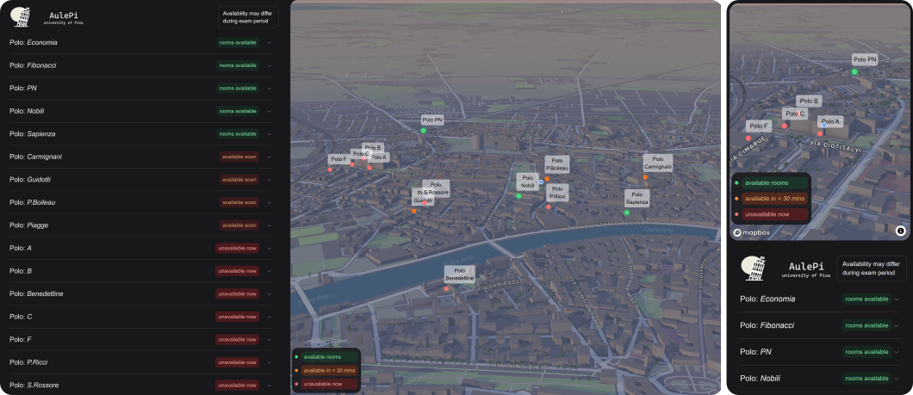

# AulePi

 
    
    
 
        Tired of wandering around the educational buildings in Pisa looking for a free room? AulePi is designed for you! This web application helps you find the closest free classroom where you can continue your studies or take a moment to relax.
    

## Features
AulePi highlights available classrooms in Pisa by utilizing a public API provided by the university. This API allows us to download the calendar for the day’s lectures. The backend processes this calendar data to provide an up-to-date view of available rooms near you. This is particularly useful for the following reasons:

- Student Positioning: Students are positioned on the map, allowing them to manually check which building contains a free classroom nearby.
- 3D Map Exploration: The application uses *Mapbox GL* for an interactive 3D view, enabling newly enrolled or Erasmus students to visually discover the locations of buildings without navigating the university's websites.
- Real-Time Availability: Classroom availability is refreshed with each page load, ensuring to provide accurate and valuable information every time.

**Example**: If I'm located near the engineering educational complex, I can quickly determine the following:

1. Polo A and Polo F currently do not have any available rooms.
2. Polo C has at least one room available.
3. Polo B has a room (*IngB23*) that will become available in 30 minutes or less. Additionally, the room schedule indicates that it will be free for two hours.

## Tech Stack
### Frontend
* Next.js: Utilizes server-side rendering to create a robust React-based framework for building the frontend user interface.
* Mapbox GL: Offers an interactive map for displaying classroom locations across the city of Pisa.
* Tailwind CSS: Implements utility-first CSS for styling UI components, ensuring a responsive and consistent design.
* Geolocation API: Retrieves the user’s current location and accurately positions them on the map.

### Backend
* Flask: A lightweight Python web framework used to handle API requests and implement the logic for retrieving and processing classroom availability data.
* Requests: A Python library integrated with Flask to fetch classroom data from external APIs.
* Vercel Blob: A library used to interact with Vercel’s blob storage.

## Deployment
Both the frontend and backend of AulePi are hosted on Vercel, ensuring reliable performance and easy scalability. This platform provides seamless integration with Git, allowing for automatic deployments with each push to the repository.
Check it out [here](https://aulepi.vercel.app)!

## Future Enhancements
- Classroom Visualization: In addition to displaying buildings, we could also showcase classrooms on the map. One approach could be to display a large marker when zoomed out, which transitions into individual classroom markers as the user zooms in. However, challenges may arise with multi-story buildings, and alternative solutions might need to be explored (indeed, this would be extremely cool if implemented).
- Notification System: Implementing a notification system could enhance user experience by providing real-time updates about classroom availability and other relevant information.

## Fork of *Spots*

This repository is a fork of the [spots repository](https://github.com/notAkki/spots) and includes modifications to interact with the current University of Pisa API system. Credit goes to the [original creator](https://github.com/notAkki) for providing such a clean and effective frontend interface.
